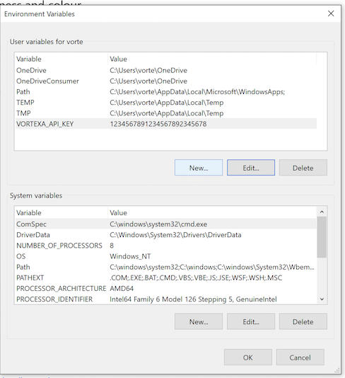

#### How to install Python on Windows using Anaconda
- Download the Python3.7 Graphical installer from the [anaconda website](https://www.anaconda.com/distribution/)
- Follow the conda installation instructions


#### How do I install the SDK on Windows?
- First, open up an Anaconda Prompt. Hit the start button and type anaconda prompt.


- Use pip to install the sdk

Run `pip install --user vortexasdk` in the anaconda command prompt


You're done! The VortexaSDK has now been installed.


#### How do I install the SDK on Mac / Linux?
Type the following into a bash terminal
```bash
$ pip install vortexasdk
```


#### How do I add an environment variable on Windows?
- Hit the windows key, then type "environment" to open up a control panel settings page titled "Edit the system environment variables"


-  In the System Properties window, click on the Advanced tab, then click the Environment Variables button near the bottom of that tab.
- Add a new user variable




#### How do I request an API Key?
You can email *support@vortexa.com* for an API key.
More details are given in [docs.vortexa.com](https://docs.vortexa.com/reference/intro-authentication).

If you don't have login details, please get in touch at [www.vortexa.com](https://www.vortexa.com/).
